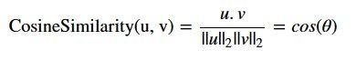
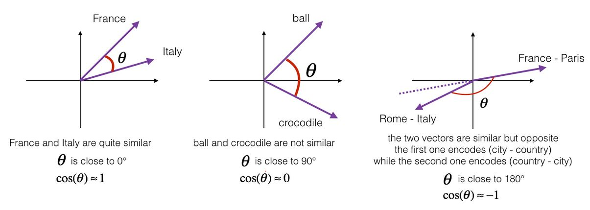

# Word_analogy-using-embeddings

As before in this [repository](https://github.com/A2Amir/Natural-Language-Processing-with-Deep-Learning) explained, word embedding is able to model the similarity between words.
To measure how similar two words are, we need a way to measure the degree of similarity between two embedding vectors for the two words. Given two vectors u and v, cosine similarity is defined as follows: 

 

where u.v is the dot product (or inner product) of two vectors, ||u||_2 is the norm (or length) of the vector u, and theta is the angle between u and v. This similarity depends on the angle between u and v. 
If u and v are very similar, their cosine similarity will be close to 1; if they are dissimilar, the cosine similarity will take a smaller value. 

  The cosine of the angle between two vectors is a measure of how similar they are

