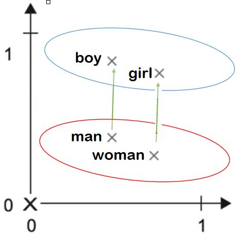

# Word_analogy-using-embeddings

As before in this [repository](https://github.com/A2Amir/Natural-Language-Processing-with-Deep-Learning) explained, word embedding is able to model the similarity between vectors (words).
To measure how similar two words(vectors) are, we need a way to measure the similarity between two vectors for the two words. Given two vectors u and v, cosine similarity is defined as follows:

# Vector comparison

Vector comparisons form the heart of our analyses in this context.

For the most part, we are interested in measuring the distance between vectors. The guiding idea is that semantically related words should be close together in the vector spaces we build, and semantically unrelated words should be far apart.

The scipy.spatial.distance module has a lot of vector comparison methods, so you might check them out if you want to go beyond the functions defined and explored here. 

##  1. Euclidean distance
The most basic and intuitive distance measure between vectors is euclidean distance. The euclidean distance between two vectors u and v of dimension n is

 

just uses the corresponding **scipy.spatial.distance** method to define it.

Notice: befor the use of the euclidean distance you should perform Length normalization:

##  2. Cosine similarity

Cosine similarity is defined as follows:

 

where u.v is the dot product (or inner product) of two vectors, ||u||_2 is the norm (or length) of the vector u, and theta is the angle between u and v. This similarity depends on the angle between u and v. 
If u and v are very similar, their cosine similarity will be close to 1; if they are dissimilar, the cosine similarity will take a smaller value. 

The cosine of the angle between two vectors is a measure of how similar they are. 

 

##  3. Other Matching based methods

Another popular family of these comparison methods,called matching-based methods.the matching coefficient is the one that I've given at the top there. you are just summing up all of the smaller of the two values,doing a point-wise comparison across the vectors that you wanna compare.Jaccard, Dice,Overlap are all defined in terms of that matching thing.

The basic matching measure effectively creates a vector consisting of all of the smaller of the two values at each coordinate, and then sums them:

 

##  4. Probablistic Vector Comparision methods
It is a good choise, if you are dealing with things that you would call probability distribution   

* KL Divergence

 
  

 

# Proper distance metric?
To qualify as a distance metric, a vector comparison methodd has to be symmetric (d(x,y) =d(y,x)), assign 0 to identical vectors (d(x,x) =0), and satisfy thetriangle inequality:
 
 

 

Cosine  distance  as  I  defined  itdoesn’t satify this:

 

 

Therfor we can use the below formula as a proper distance metrice

 

---

In the word embedding space, the geometric relationships between word vectors should reflect the semantic relationships between these words. 
Word embeddings are meant to map human language into a geometric space. For instance, in a reasonable embedding space, we would expect synonyms to be embedded into similar word vectors, and in general we would expect the geometric distance (e.g. L2 distance) between any two word vectors to relate to the semantic distance of the associated words (words meaning very different things would be embedded to points 
far away from each other, while related words would be closer). Even beyond more distance, we may want specific __directions__ in the embedding space to be meaningful.**The same vector (green vector) that allows us to go from man to boy allows us also go from boy to girl.**
In real-world word embedding spaces, common examples of meaningful geometric transformations are "gender vectors" and "plural vector". For instance, by adding a "female vector" to the vector "king", one obtain the vector "queen". By adding a "plural vector", one obtain "kings".
Word embedding spaces typically feature thousands of such interpretable and potentially useful vectors.

 

