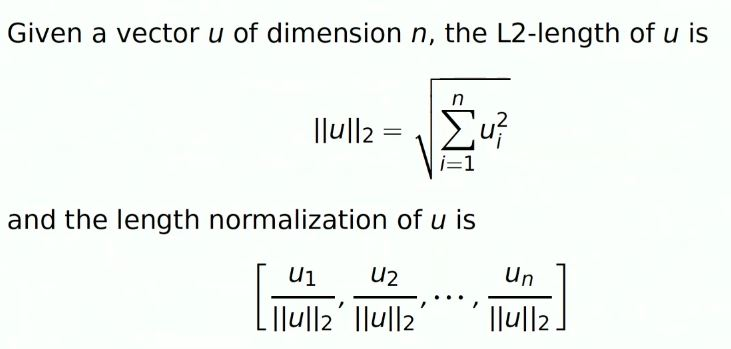

# Word_analogy-using-embeddings

As before in this [repository](https://github.com/A2Amir/Natural-Language-Processing-with-Deep-Learning) explained, word embedding is able to model the similarity between vectors (words).
To measure how similar two words are, we need a way to measure the similarity between two vectors for the two words. Given two vectors u and v, cosine similarity is defined as follows:

Vector comparison

Vector comparisons form the heart of our analyses in this context.

For the most part, we are interested in measuring the distance between vectors. The guiding idea is that semantically related words should be close together in the vector spaces we build, and semantically unrelated words should be far apart.

The scipy.spatial.distance module has a lot of vector comparison methods, so you might check them out if you want to go beyond the functions defined and explored here. 

##  1. Euclidean distance
The most basic and intuitive distance measure between vectors is euclidean distance. The euclidean distance between two vectors u and v of dimension n is

 

just uses the corresponding scipy.spatial.distance method to define it.

Notice: befor the use of the euclidean distance you should perform Length normalization:

##  2. Cosine similarity

cosine similarity is defined as follows:

 

where u.v is the dot product (or inner product) of two vectors, ||u||_2 is the norm (or length) of the vector u, and theta is the angle between u and v. This similarity depends on the angle between u and v. 
If u and v are very similar, their cosine similarity will be close to 1; if they are dissimilar, the cosine similarity will take a smaller value. 

The cosine of the angle between two vectors is a measure of how similar they are. 

 

3- Other Matching based methods

another popular family of these comparison methods,called matching-based methods.the matching coefficient is the one that I've given at the top there. you are just summing up all of the smaller of the two values,doing a point-wise comparison across the vectors that you wanna compare.Jaccard, Dice,Overlap are all defined in terms of that matching thing.

The basic matching measure effectively creates a vector consisting of all of the smaller of the two values at each coordinate, and then sums them:

 

This is implemented in vsm as matching.

One approach to normalizing the matching values is the Jaccard coefficient. The numerator is the matching coefficient. The denominator — the normalizer — is intuitively like the set union: for binary vectors, it gives the cardinality of the union of the two being compared:
$$\textbf{jaccard}(u, v) = 1 - \frac{\textbf{matching}(u, v)}{\sum_{i=1}^{n} \max(u_{i}, v_{i})}$$

In addition to the similarity we want specific direction in the embedding space to be meaningful, the same vector (green vector) that allows us to go from man to woman allows us also go from boy to girl. 

 

